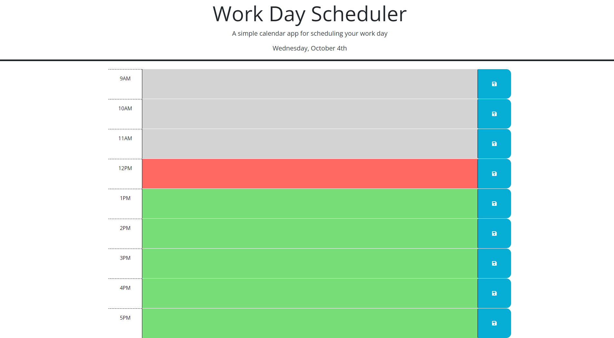
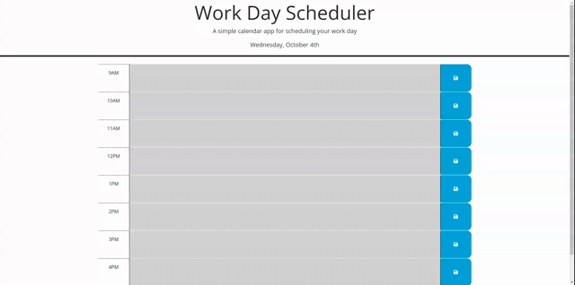

# Daily Planner

## Description

A web app that allows for daily planning by saving notes on a given hour for the day. <br>
[Deployed Website](https://fenriragni.github.io/daily-planner/)


## Technology Used

|Technology Name|Resource|
|-----------|------------|
|JavaScript|[link](https://www.w3schools.com/js/js_intro.asp)|
|CSS|[link](https://www.w3schools.com/css/css_intro.asp)|
|Git|[link](https://www.w3schools.com/git/git_intro.asp?remote=github)|
|JQuery|[link](https://jquery.com/)|
|Bootstrap|[link](https://getbootstrap.com/docs/5.1/getting-started/introduction/)|
|FontAwesome|[link](https://fontawesome.com/docs)|
|DayJS|[link](https://day.js.org/en/)|

## Usage

On page load, you are shown the current day at the top.
You are able to enter text into the blank space and then save it using the save button on the right:


This persists on new page loads until emptied and saved again

## Learning Points
During this project I learned that because our JQuery caller looks for a string, you can modify that string with variables to reach a multitude of elements with a simple for loop
```js
for(var x = 0; x < calendar.children().length; x++){
    var hour = x + 9;
    var textInfo = localStorage.getItem("hour-"+ hour);
    if(!(textInfo === undefined)){
      $("#hour-"+ hour).children("textarea").val(textInfo);
    }
    if(currentHour.hour() < hour){
      $("#hour-"+ hour).addClass("future");
    }
    else if(currentHour.hour() > hour){
      $("#hour-"+ hour).addClass("past");
    }
    else {
      $("#hour-"+ hour).addClass("present");
    } 
}
```
The for loop goes through each of the time-block elements and sets info from localStorage and then sets the background color based on the current DayJS object

## Author Info

Alonso Ampuero <br>
[Twitter](https://www.twitter.com/fenri.ragni) <br>
[Github](https://www.github.com/fenri.ragni) <br>
[Portfolio](https://fenriragni.github.io/pro-portfolio/)